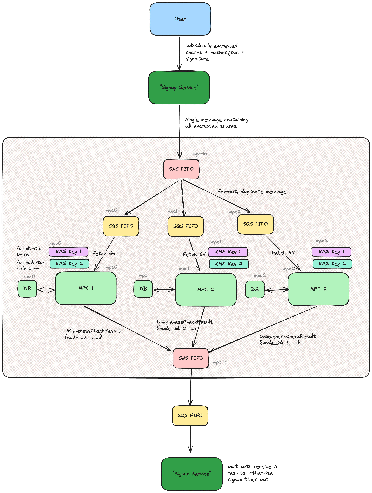

# iris-mpc

## Contributing

We welcome contributions to this project! Please follow these guidelines when contributing:

### Pull Requests

- Fork the repository and create a new branch for your changes
- Make your changes and ensure all tests pass
- Submit a pull request with a clear description of your changes
- All pull requests will be reviewed before merging

### Signed Commits

- All commits must be signed with your SSH/GPG key
- Configure Git to sign commits automatically:

    ```bash
    git config --global user.signingkey <SSH signing key path/your-gpg-key-id>
    git config --global commit.gpgsign true
    ```

- Verify your commits are signed with `git log --show-signature`

### Code Standards

- Follow the existing code style and conventions
- Include appropriate tests for new functionality
- Update documentation as needed

### Pre-commit hooks
We use pre-commit hooks to ensure our changes adhere to the project's standards. Please set up pre-commit hooks by running:
```bash
./scripts/setup-pre-commit.sh
pre-commit run --all-files
```

## How to release

New releases are created automagically by [Release Drafter GH action](https://github.com/worldcoin//gpu-iris-mpc/actions/workflows/release.yaml).

Type of release bump is made of commits (tags feat/bugfix/etc...).

Release is created as draft, so you have to edit it manually and change it to final.

After release creation the build image is starting with tag with release number.

## Setup

- GPU-based node implementation in `iris-mpc/src/bin/server.rs`
- CPU-based node PoC in `iris-mpc/src/bin/server_hawk.rs`
- Example client in `src/bin/client.rs`

## GPU Implementation

#### Running the E2E test binary (single machine)

```
NCCL_P2P_DIRECT_DISABLE=1 NCCL_NET=Socket cargo test --release e2e
# run with compute sanitizer (a bit of preprocessing to get the test binary name)
cargo test --release e2e --no-run 2>&1 | grep "Executable tests/e2e.rs" | sed "s/.*(\(.*\))/\1/" | NCCL_P2P_DIRECT_DISABLE=1 NCCL_NET=Socket xargs compute-sanitizer --tool=memcheck
```

#### Running the server without config override

```
AWS_REGION=eu-north-1 AWS_ACCESS_KEY_ID=xxx AWS_SECRET_ACCESS_KEY=xxx cargo run --release -p iris-mpc-bins --bin iris-mpc-gpu
```

#### Running the server with override

```
AWS_REGION=eu-north-1 AWS_ACCESS_KEY_ID=xxx AWS_SECRET_ACCESS_KEY=xxx cargo run --release -p iris-mpc-bins --bin iris-mpc-gpu -- --party-id {0,1,2} --queue https://sqs.eu-north-1.amazonaws.com/xxx/mpc1.fifo
```

#### Running the client

```
AWS_ACCESS_KEY_ID=xxx AWS_SECRET_ACCESS_KEY=xxx cargo run --release -p iris-mpc-bins --bin client -- --topic-arn arn:aws:sns:eu-north-1:xxx:mpc.fifo
```

### Server configuration

Please note that this mechanism does not apply to the client part.

#### Environment variables

Application can be completely configured via environment variables. To see the list of variables please check out contents of the `.env*` files.

**Important!**
Please note that there is a dist file per an instance of MPC node. Before running, please make sure to rename the correct dist file to `.env`.

For now the environment variables are read in via a `dotenvy` crate for the ease of development.

#### CLI arguments

Not to force developers into a change of approach to work that has been established, overloading the environment variables with CLI arguments is also possible.
List of possible overrides is represented by the following `struct`:

```rust
pub struct Opt {
    #[structopt(long)]
    requests_queue_url: Option<String>,

    #[structopt(long)]
    results_topic_arn: Option<String>,

    #[structopt(long)]
    party_id: Option<usize>,

    #[structopt(long)]
    bootstrap_url: Option<String>,

    #[structopt(long)]
    path: Option<String>,
}
```

Please note that due to ambiguity, all the arguments need to be provided using their full names.

### Dependencies

Requires a NVIDIA graphics card with recent drivers and CUDA libraries.

The following dependency versions have been confirmed to work:

- nvidia-x11-550.78-6.9.6
- cuda_nvrtc-12.2.140
- libcublas-12.2.5.6

Some Linux distributions have a (lib)cuda package 12.2 which depends on earlier versions of these packages.
It might not work.

### Direnv setup

If you're running with libraries in non-standard paths you'll likely want to setup direnv to automatically load the env vars for configuration.

[Make sure to install direnv](https://direnv.net/)

Then copy `.envrc.example` to `.envrc` and setup `$PRE_CARGO_LD_LIBRARY_PATH` env var to point to your installation of the cuda toolkit libs.

The example file contains a sample WSL env var.

## CPU Implementation

### Requirements

1. `direnv` installed on your machine
2. Run `direnv allow` in the root of the project. This will enable you to load all required env variables from the .test.env and .envrc files

#### Option 1: Locally run a single server without Docker (recommended for quick iteration)

**Step 1: run ancillary services**

```
docker-compose -f docker-compose.dev.yaml up
```

**Step 2: run service with the init script for Party 0**

```
./scripts/run-server.sh 0 --init-servers # change to 1 or 2 for other parties
```

The script must run with `--init-servers` flag at least once. It will create some AWS resources, but after that it can run without it.

```
./scripts/run-server.sh 1
./scripts/run-server.sh 2 # in a separate shell
```

#### Option 1a: Use a pre-populated database for hawk or genesis
The files `docker-compose.genesis.yaml` and `docker-compose.hawk.yaml` use a persistent volume. The user still has to populate the database before use. This is accomplished with the `init-test-dbs` executable.

For genesis, `Dockerfile.postgres` is provided, which includes a start-up script to clear the CPU databases on each run. No such functionality is provided for hawk - the database and graph are not reset between runs.

#### Option 2: Run everything with docker

Just run

```bash
docker build -f Dockerfile.dev.hawk -t hawk-server-local-build:latest .
docker-compose -f docker-compose.test.yaml up
```

It will bring up the 3 parties plus all the needed AWS/DB resources

### Running Requests Against the Local Servers

In either option you can send batches of requests to the SNS topics that will then be forwarded to the SQS
queues from which the servers can read. This can be done with the `client` binary. We provide a bash script to
simplify its invocation:

```bash
./scripts/run-client.sh
```

This will send a batch of requests to the SNS topic. You can also run the client by itself with the `--help` flag to see all the available options.
Check out also the [client.rs](iris-mpc/src/client.rs) file for more details.

### Running Requests with file data

```bash
cargo run -p iris-mpc-bins --bin client -- \
    --request-topic-arn arn:aws:sns:us-east-1:000000000000:iris-mpc-input.fifo \
    --requests-bucket-name wf-smpcv2-dev-sns-requests \
    --public-key-base-url "http://localhost:4566/wf-dev-public-keys" \
    --region us-east-1 \
    --response-queue-url http://sqs.us-east-1.localhost.localstack.cloud:4566/000000000000/iris-mpc-results-us-east-1.fifo \
    --data-from-file signup_sequence_shares_optin_both_sides.json \
    --populate-file-data-limit 0
```

- 0 is to use all data in file otherwise one can specify a limit

This will send a batch of requests to the SNS topic. You can also run the client by itself with the `--help` flag to see all the available options.
Check out also the [client.rs](iris-mpc/src/client.rs) file for more details.

#### Testing

```
cargo test --release -- --test-threads=1
cargo test --release --features db_dependent -- --test-threads=1 # require a runnning postgres instance
```

If you are using `cargo test` with non-standard library paths, you might need [a workaround](https://github.com/worldcoin/iris-mpc/issues/25).

## CPU Genesis
1. Create the generated data (this will be generated to the `iris-mpc-bins/data` folder)

- note you can change the value of the benchmark data to generate less data (100 is required for local stack) in `iris-mpc-bins/bin/iris-mpc-cpu/generate_benchmark_data.rs`

```bash
cargo run -p iris-mpc-bins --bin generate-benchmark-data
```

2. Build the hawk genesis binary

```bash
docker build -f Dockerfile.genesis.dev.hawk -t hawk-server-genesis:latest .
```

3. Run the upgrade server
* note this also instantiates a shares database for Genesis to use (the default is 100). You can edit the value for this in `docker-compose.test.genesis.yaml`
* by default genesis runs with a max index of 100. This can be edited in `scripts/run-sever-docker.sh`
```bash
docker-compose -f docker-compose.test.genesis.yaml up
```

Note: This also instantiates iris shares db with shares

## Architecture



## How to run client in the prod-dev env

```bash
cargo run -p iris-mpc-bins --release --bin client -- \
    --request-topic-arn arn:aws:sns:eu-north-1:767397716933:gpu-iris-mpc-input.fifo \
    --request-topic-region eu-north-1 \
    --response-queue-url https://sqs.eu-north-1.amazonaws.com/654654380399/temporal-results.fifo \
    --response-queue-region eu-north-1 \
    --requests-bucket-name wf-mpc-prod-smpcv2-sns-requests \
    --public-key-base-url https://d2k2ck8dyw4s60.cloudfront.net \
    --requests-bucket-region eu-north-1
```

## License

Unless otherwise specified, all code in this repository is dual-licensed under
either:

- MIT License ([LICENSE-MIT](LICENSE-MIT))
- Apache License, Version 2.0, with LLVM Exceptions ([LICENSE-APACHE](LICENSE-APACHE))

at your option. This means you may select the license you prefer to use.

Any contribution intentionally submitted for inclusion in the work by you, as
defined in the Apache-2.0 license, shall be dual licensed as above, without any
additional terms or conditions.
