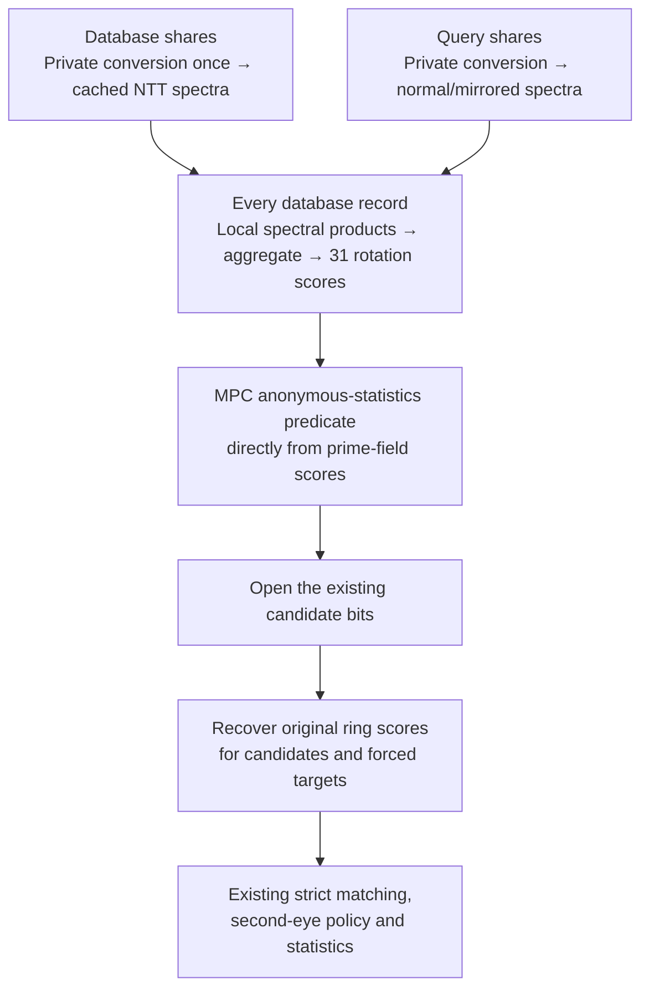

# CPU NTT scan: end-to-end protocol walkthrough

The current design is a hybrid protocol: use an exact prime-field NTT for the
exhaustive scan and its anonymous-statistics predicate, then use the existing
ring protocols for selected candidates. Every database record and every original
dimension participates in the exhaustive stage, with all 31 allowed rotations
and both normal and mirrored orientations.

The two biggest realizations were:

- **All channels can share one inverse transform.**
- **The exhaustive stage only needs a threshold decision, so every score does
  not need conversion back into the original ring.**

## 1. Rotations are shifts within circular sequences

The 12,800 code coordinates can be rearranged into:

$$
64\text{ channels}\times200\text{ angular columns}.
$$

The 64 channels represent different radial positions, wavelengths, and
real/imaginary components. The masks have 32 distinct channels because each
mask applies to two code components. This is a lossless reordering.

A rotation shifts the angular position within every channel by the same amount:

$$
C_r=\sum_{a=0}^{63}\sum_{t=0}^{199}
q_a[t]d_a[(t+r)\bmod200].
$$

Thus, **64 is the number of code channels; 31 is the number of requested
shifts**, $r=-15,\ldots,15$. Every coordinate still participates. The other
169 possible circular shifts are not accepted by the matcher.

This structure makes the score a circular correlation.

## 2. The NTT computes circular correlation exactly

An NTT is the finite-field analogue of a Fourier transform. The implementation
uses:

$$
p=52201,\qquad \omega=43061,
$$

where $\omega$ has order 200. Such a root exists because
$p-1=261\times200$. All arithmetic is modulo $p$.

Define the forward transform:

$$
\widehat q[k]=\sum_{t=0}^{199}q[t]\omega^{kt}.
$$

For one channel, form:

$$
P[k]=\widehat q[-k]\widehat d[k].
$$

Its inverse gives the circular correlation:

$$
\mathrm{INTT}(P)[r]
=200^{-1}\sum_{k=0}^{199}P[k]\omega^{-kr}
=\sum_{t=0}^{199}q[t]d[t+r].
$$

Indices wrap modulo 200. To see why this works, expand the product inside the
inverse. Each term has a factor $\omega^{k(s-t-r)}$. Summing over $k$ gives
zero unless $s=t+r\pmod{200}$, in which case it gives 200. The normalization
cancels that factor.

Database transforms are precomputed and stored. Query transforms are computed
once per query. There is no floating-point rounding, and the 200-point transform
requires no sequence padding.

## 3. Multiply corresponding channels, then aggregate before the inverse

For the code score, build one spectrum:

$$
S_C[k]=\sum_{a=0}^{63}\widehat q_a[-k]\widehat d_a[k].
$$

Linearity gives:

$$
\sum_a\mathrm{INTT}(P_a)
=\mathrm{INTT}\left(\sum_aP_a\right).
$$

**This removes the need for 64 separate code inverses.** The same applies to
the 32 mask channels.

The order matters: multiply corresponding channels first, then sum their
products. Multiplying the separately summed query and database spectra would
introduce unwanted cross-channel terms.

One aggregate spectrum contains the rotation scores for **one database record
and one orientation**. A full inverse would return 200 shifts; the selected
inverse evaluates only the 31 allowed shifts. This is not one inverse for the
entire database.

This is why 31 rotations can justify an NTT here. The straightforward coordinate
calculation needs:

$$
31(12800+6400)=595200
$$

scalar products. The spectral-product stage needs:

$$
200(64+32)=19200,
$$

followed by the selected inverse. These are arithmetic counts, not CPU speedup
predictions: modular reductions, byte packing, memory traffic, and MPC have
their own costs.

## 4. Combine code and mask into the one score the dense stage needs

For code bit $b$ and validity bit $v$, the signed encoding is
$x=v(1-2b)$. Let $C$ be the dot product of these masked signed codes and $M$
the full mask overlap. For positive overlap, Hamming distance is:

$$
d=\frac{M-C}{2M}.
$$

The anonymous-statistics threshold is 0.375, corresponding to:

$$
4C-M\ge0.
$$

Since the stored mask score is $m=M/2$, the predicate becomes:

$$
g=2C-m\ge0.
$$

The implementation preserves the existing predicate's equality and zero-overlap
behavior; it does not replace the production rules with a new fractional-distance
comparison.

We therefore combine the spectra themselves:

$$
S_g[k]=2S_C[k]-S_m[k].
$$

**One inverse now produces the anonymous-threshold score for all 31 rotations,
combining both code and mask.** Separate $C_r$ and $M_r$ values are unnecessary
for every database record.

This also explains the current prime. Valid inputs satisfy:

$$
0\le m\le6400,\qquad |C|\le2m,
$$

so:

$$
-32000\le g\le19200.
$$

The earlier prime 25601 was sufficient for individual code correlations, but
cannot distinguish every value in this wider combined-score interval. The
current 52201 supports the transform and accommodates the required interval
while fitting in 16 bits.

## 5. Privately convert the existing shares into the prime field

The deployed shares use a degree-four Galois ring over
$\mathbb Z/65536\mathbb Z$. Reducing each share modulo 52201 would be incorrect.
For example:

$$
65535+1=0\pmod{65536},\qquad
65535+1=13335\pmod{52201}.
$$

The new input-conversion protocol uses the restricted plaintext encoding. A
masked code coordinate satisfies:

$$
x\in\{-1,0,1\},\qquad
x=\mathrm{LSB}(x)-2\mathrm{MSB}(x),
$$

where the bits refer to its original 16-bit ring encoding. Mask coordinates
are bits.

The protocol privately reconstructs this encoding in shares: undo the original
basis/reconstruction mapping, obtain replicated ring shares, extract the
required bits with MPC, and inject those bits into the prime field. Bit
injection uses identities such as:

$$
b\oplus c=b+c-2bc.
$$

Two masked field multiplications combine the three XOR-share components.
Finally, local linear maps turn replicated field components into degree-one
Shamir shares at points 1, 2, and 3.

That final map needs no communication. A replicated additive component $x_i$
is known to two parties. If the missing party has evaluation point $z_m$, assign
the component the polynomial $x_i(z_m-z)/z_m$. Its constant is $x_i$, and its
evaluation at the missing party is zero. Summing these polynomials gives a
degree-one sharing of the original coordinate.

**No iris coordinate is opened.** Database conversion is paid once per stored
version and cached; query conversion is paid once per query. This retains the
existing three-party semi-honest security assumptions and valid ternary-code /
binary-mask input assumptions. It does not add a proof of client input validity.

## 6. Compute spectral scores locally on the new shares

NTTs are linear, so each party can transform its own Shamir shares locally.

Multiplying two degree-one shares produces a degree-two evaluation. Subsequent
channel sums and inverse transforms remain linear operations. Communication
can therefore be deferred until the final score contribution.

At party points 1, 2, and 3, the degree-two reconstruction weights are:

$$
[3,-3,1].
$$

These weights, inverse normalization $200^{-1}$, and the code/mask weights
$(2,-1)$ are folded into query preprocessing. Consequently, the three parties'
local outputs $g_i$ satisfy:

$$
g=\sum_i g_i\pmod p.
$$

**There is no interactive MPC multiplication for every frequency or channel.**
Communication resumes when the private threshold decision is needed.

## 7. Evaluate the anonymous predicate directly in the prime field

This is the change that rescued end-to-end performance.

The first integration computed prime-field scores and converted every result
back into the original ring. That bridge needed MPC to handle modular wrap
correctly, repeated across millions of records and 31 rotations. It consumed
the local kernel gain.

The current protocol instead adds a public offset:

$$
Y=g+32768.
$$

For valid scores:

$$
768\le Y\le51968<p.
$$

Therefore:

$$
g\ge0\iff\mathrm{bit}_{15}(Y)=1.
$$

Extracting that bit from secret shares still requires MPC. First refresh the
local contributions into replicated field shares. Then privately split them
into two binary-shared values $u,v$, with:

$$
W=u+v,\qquad Y=W\bmod p.
$$

For replicated additive components $a,b,c$, the split uses
$u=(a+b)\bmod p$ and $v=c$. The pair-owning party reduces its local sum before
XOR-masking it. Neither the pair sum nor the score is opened.

Because $u,v<p$, there is at most one field wrap. Define:

$$
b_{15}=\mathrm{bit}_{15}(W),\qquad
b_{16}=\mathrm{bit}_{16}(W),\qquad
L=[W\bmod32768\ge19433].
$$

The exact acceptance bit is:

$$
b_{15}\oplus\left(L\land(b_{15}\oplus b_{16})\right).
$$

**Choosing offset 32768 makes the wrap comparisons share their lower 15 bits.**
The relevant thresholds 52201 and 84969 differ by 32768. Computing the addition
and low-bit comparison together requires 16 adder ANDs, 14 comparison ANDs, and
one final mux: **31 secure ANDs**, down from 46 at offset 32000, still in 17 AND
layers.

| Dense predicate | ANDs per score | AND layers | Ideal bytes sent per party per rotation |
| --- | ---: | ---: | ---: |
| Original ring path | 66 | 17 | 12.375 |
| Earlier native-prime predicate | 46 | 17 | 8.542 |
| Current native-prime predicate | **31** | **17** | **6.667** |

Payload counts include refresh, split, gates, and opening, and exclude transport
overhead. The prime path adds one communication phase relative to the original
path. The 17 AND layers are not the entire protocol's communication count.

The gates are packed across 64 scores at a time. Masks come from pairwise PRFs,
with uniform field sampling by rejection; no edaBit inventory is needed.

## 8. Recover full scores only for the existing public candidates

Open the same anonymous-statistics predicate bits that the previous scan
opened. The values $g$, $C$, and $M$ remain secret-shared.

If any rotation passes for a record, recompute that record's original ring
code/mask scores for all 31 rotations. Forced reauthentication targets are
included as well.

The existing protocols then handle the stricter 0.345 match threshold,
second-eye policy, retained distances, and anonymous-statistics processing.
The strict threshold retains its existing fixed-point implementation and
boundary behavior.

**Candidate-only recovery changes where work is spent.** Every record receives
an exact exhaustive threshold test; only selected records need full score
pairs. Actual statistics distances continue to use the original ring
representation. The selected full-scan eye is exhaustive; the other eye follows
the existing candidate policy.

Candidate recovery remains a workload-dependent cost. More accepted records
mean more recovery work. The optimization relies on the existing public
candidate selection and does not introduce an index or an approximate filter.

## 9. Pack the arithmetic for the CPU and reuse inverse work

Field coefficients are centered in $[-26100,26100]$ and stored exactly as two
signed bytes:

$$
x=x_{\mathrm{lo}}+256x_{\mathrm{hi}}.
$$

This lets Graviton's SMMLA instructions process byte products efficiently,
batching eight records and both orientations. All four byte-product combinations
are needed: unlike arithmetic modulo 65536, the high-high term does not vanish
modulo 52201. Partial sums have checked bounds and are recombined in wider
integers before reduction.

The selected inverse pairs frequencies $k$ and $200-k$. Their sums and
differences are reused to compute rotations $+r$ and $-r$ together. Rotation
zero largely needs summation. Inverse normalization and public weights are
precomputed on the query side.

The latest MPC implementation also avoids cloning buffers before serialization
and avoids expanding packed secret predicate bits only to repack them for
transmission. Only public results are expanded to booleans. Random-mask
generation is batched, although that change alone did not show a measurable
matching-throughput gain.

Only the SMMLA instruction has an assembly wrapper; Rust controls the loops,
loads, and registers. Other CPUs have an exact portable path.

These changes are separate from the degree-eight / 255-point Galois-ring
proposal. **The implemented path uses scalar prime-field arithmetic and a
200-point transform.** It does not use degree-eight Karatsuba multiplication.

## 10. Persist and maintain a derived spectral database

The NTT representation has the same payload size as the original shares for
one eye:

$$
(12800+6400)\times2=38400\text{ bytes}.
$$

In memory, it replaces the full scan-eye representation, alongside bounded raw
caches. On disk, original shares remain authoritative and the spectral cache
is additional. Keeping originals for both eyes plus spectra for one eye
increases raw payload from **76,800 to 115,200 bytes per record per party**, or
**50%**, excluding database metadata and storage overhead.

The derived cache records versions and a common conversion generation. All
parties must use shares from the same generation. If a cache is incomplete or
inconsistent, the parties jointly rebuild it; mixing one party's fresh
conversion with another's old conversion would produce invalid shared scores.
Inconsistent authoritative record versions fail startup.

Inserts, updates, deletions, and restart recovery maintain this cache. The
implementation remains opt-in with `IRIS_MPC_CPU_NTT=1`, configured consistently
across all three parties. Disabling it restores the original CPU path; original
shares remain available.

The initial private conversion and persistence of approximately 1.049 million
records took about 645 seconds in the integration benchmark. A later startup
loaded the cached spectral database in about 12.7 seconds on party 0. These are
startup costs, excluded from steady scan timing.

## 11. Allocate CPU capacity to MPC and remove synchronization stalls

Once scoring became faster, MPC and communication needed a larger share of the
CPU. The measured allocation moved from 85 scoring cores / 11 runtime cores to
**64 scoring cores / 32 runtime cores**. Giving eight cores back to scoring or
doubling scan concurrency reduced throughput in the final experiments.

Batch synchronization also created a new HTTP client on every poll and slept
one second when a peer was briefly on a different batch. The fix in
[ampc-common #150](https://github.com/worldcoin/ampc-common/pull/150) reuses
connections and retries ordinary peer lag after 5 ms, doubling the delay up to
100 ms. Transport-error retries and synchronization checks remain in place.
This improvement benefits the service independently of NTT.

## Measurements and comparison scope

The completed 2026-09-05 measurements on three r8g.24xlarge hosts include a
non-NTT rerun with the same synchronization fix:

| Scope | Non-NTT | NTT |
| --- | ---: | ---: |
| Matching stage | 6.40M comp/s | 15.15–15.16M comp/s |
| Warmed queued service, same synchronization fix | 6.30M comp/s | 13.42–13.43M comp/s |
| Isolated NTT score kernel, 64 scoring cores | — | 21.15M comp/s |

The fair service comparison is **2.13x**. The earlier 2.46x comparison used the
5.45M comp/s non-NTT result from before the synchronization fix. It therefore
included that independent service improvement in the ratio.

One comparison means one database record, one eye, one orientation, including
all 31 rotations and all dimensions. Rates are not multiplied by parties or
rotations. Service runs used approximately one million database records and
128 fresh nonmatching requests, excluding 16 warm-ups from the queued completion
interval. The reported matching rate and queued service rate have different
timing scopes.

The kernel excludes MPC, query conversion, ingestion, candidate handling,
persistence, and result delivery. Query conversion/preprocessing had a 9.7-ms
median in a diagnostic run. Measured traffic fell from about 563 MB to 440 MB
sent per party per request after the predicate changes. Those costs explain why
local kernel throughput cannot be substituted for service throughput.

Whole-burst service rates still varied with initial request delivery. These
were finite synthetic bursts using Moto for AWS APIs, not sustained production
capacity measurements. See the [complete measurements and reproduction
instructions](cpu-ntt-scan.md#native-prime-server-performance) for all tested
configurations and timing scopes.

## Implementation map

| Change | Implementation |
| --- | --- |
| Private input conversion | [conversion.rs](../iris-mpc-cpu/src/protocol/ntt/conversion.rs) |
| NTT, byte packing, local products, selected inverse | [transform.rs](../iris-mpc-cpu/src/protocol/ntt/transform.rs) |
| Prime-field anonymous predicate and packed opening | [threshold.rs](../iris-mpc-cpu/src/protocol/ntt/threshold.rs) |
| Candidate recovery and existing ring protocols | [aby3_store.rs](../iris-mpc-cpu/src/hawkers/aby3/aby3_store.rs) |
| Query cache and resident spectral eye | [spectral.rs](../iris-mpc-cpu/src/execution/hawk_main/spectral.rs) |
| Joint cache validation and conversion | [persistence.rs](../iris-mpc-cpu/src/protocol/ntt/persistence.rs) |
| Derived database table | [SQL migration](../migrations/20260905000000_cpu_spectral_irises.up.sql) |
| Connection reuse and peer polling | [ampc-common #150](https://github.com/worldcoin/ampc-common/pull/150) |

This walkthrough describes the implementation in
[iris-mpc #2386](https://github.com/worldcoin/iris-mpc/pull/2386), stacked on
[PR #2348](https://github.com/worldcoin/iris-mpc/pull/2348). The earlier
[spectral research note](exhaustive-spectral-matching.md) also contains
historical alternatives and measurements; its older prime and kernel-only
figures should be read in that context.
