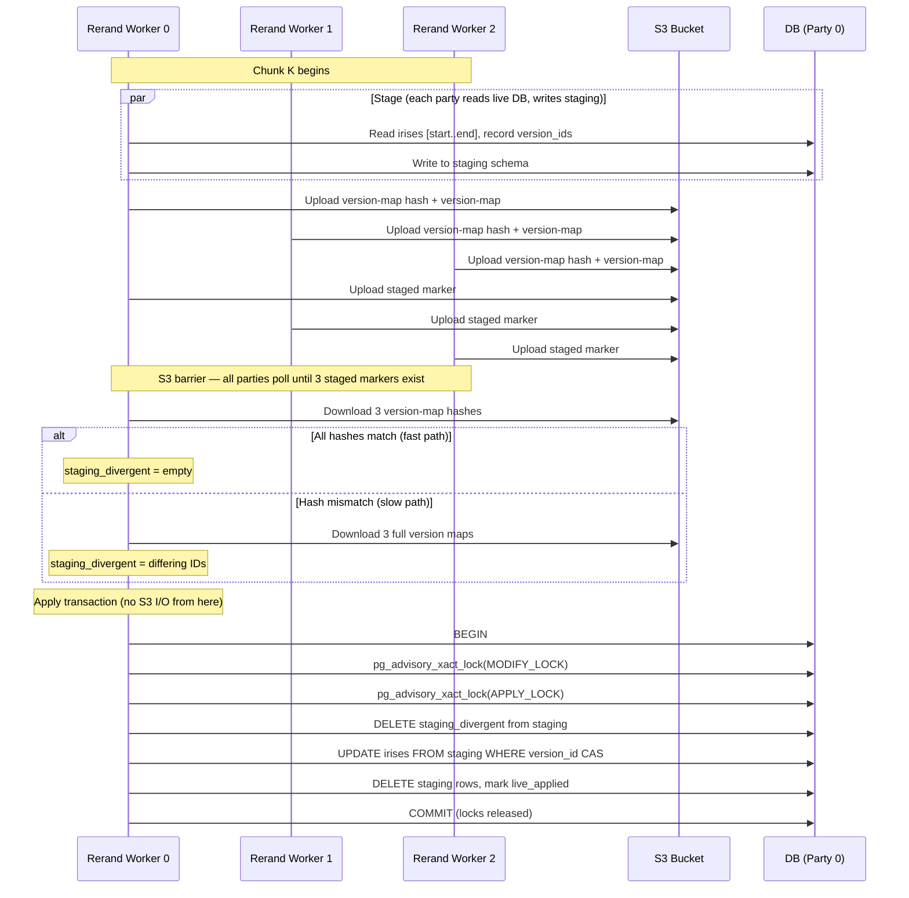
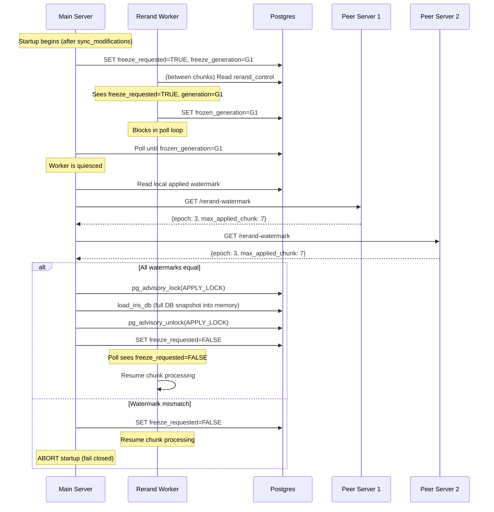
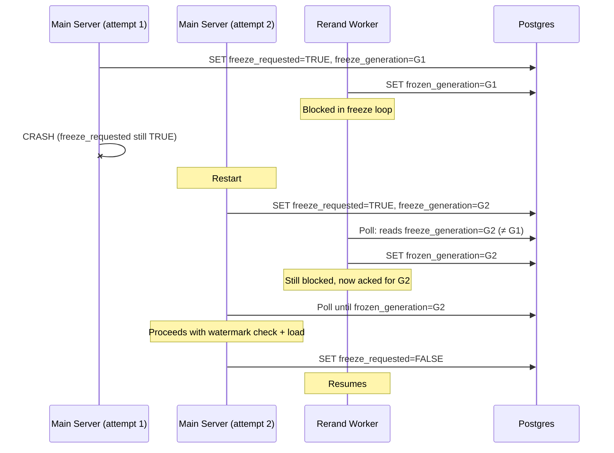
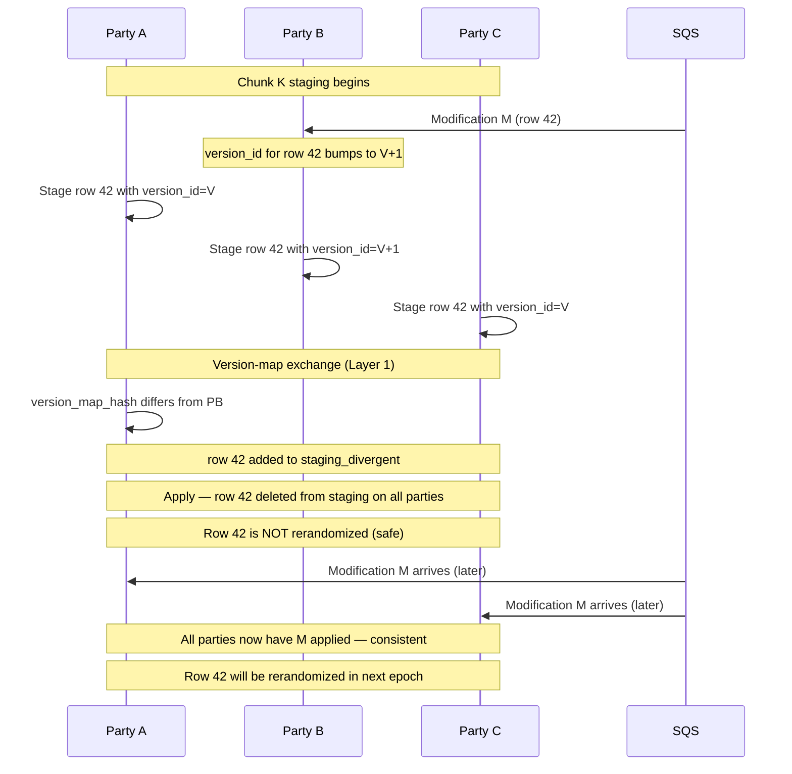
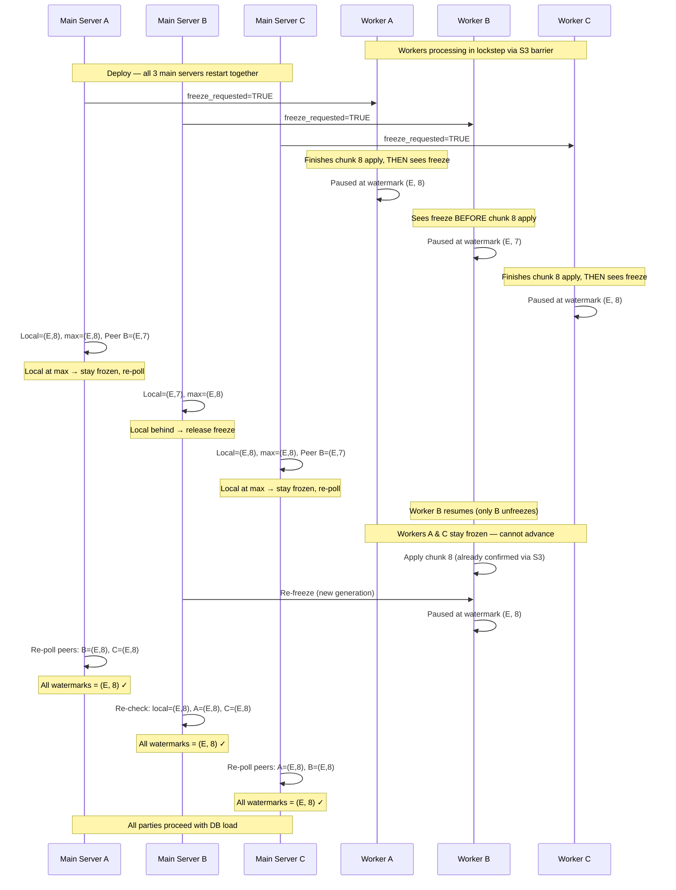
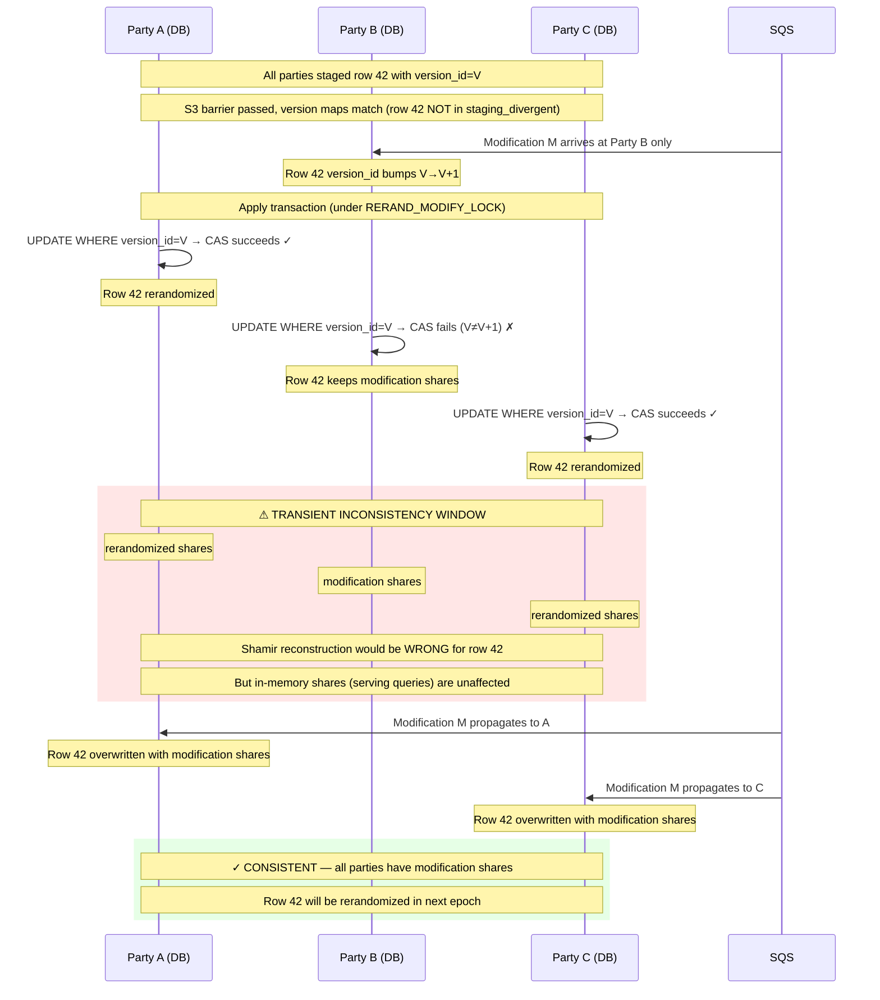

# Continuous Rerandomization Plan

## Overview

Replaces the existing, one-off rerandomization protocol by a continuous, online process that rerandomizes shares while the system is running. No downtime or restart required.

Key design decision: in-memory shares are less likely to be exfiltrated, so only the DB (at-rest persistence) is rerandomized. The actor is completely unmodified. The rerand server handles everything, writing to a staging schema and then copying to live once all parties confirm.

## Critical assumption: reliable modification delivery

The correctness of this protocol depends on **every modification (reauth, deletion, reset) eventually arriving at every party via SQS**. This is a pre-existing system invariant — without it, the MPC shares diverge regardless of rerandomization. Rerandomization does not weaken this guarantee, but it does create a new transient inconsistency window (see [Post-staging modifications](#post-staging-modifications-transient-inconsistency)) that relies on modification delivery to self-correct.

Three mechanisms enforce this invariant:

1. **SQS delete after persist** — the SQS message is only deleted *after* the modification row is durably written to the DB. If the process crashes between receiving and persisting, SQS redelivers the message. This eliminates the window where a message could be lost between delete and persist.

2. **Startup reconciliation recovers missing modifications** — `sync_modifications` compares modification state across all three parties. If a modification is completed on peers but missing locally (e.g., from a historical race before the delete-after-persist fix), it is now recovered from the peer's copy and applied locally. Large modification-ID drift across nodes is logged as an error but does not crash the process, allowing best-effort reconciliation.

3. **Remaining gap**: `sync_modifications` is a startup procedure, not a continuous background loop. A running node that permanently lost a modification (and never restarts) will stay inconsistent for the affected row until the next epoch re-randomizes it. Periodic rolling restarts or a future continuous reconciliation loop would close this gap entirely.

## Architecture

1. **Rerand Server** (separate process, one per party) — rerandomizes shares, writes to staging, coordinates with peers via S3 markers, copies confirmed chunks to live DB.
2. **Main Server** (existing, minimal changes) — acquires `RERAND_APPLY_LOCK` at startup to freeze applies during `load_iris_db`. Acquires `RERAND_MODIFY_LOCK` during modification writes to serialize with rerand applies.

The GPU actor, batch processing, and result processor are completely untouched.

## Seed & Randomness

One epoch is active at a time. At the start of each epoch:

1. Each rerand server generates a fresh BLS12-381 keypair
2. Private key is saved to Secrets Manager at `{env}/iris-mpc-db-rerandomization/epoch-{E}/private-key-party-{P}`
3. Public key is uploaded to S3 at `s3://bucket/rerand/epoch-{E}/party-{P}/public-key`
4. Each rerand server downloads the other two parties' public keys from S3 (polling until all present)
5. Each derives the same 32-byte `shared_secret` via the BLS12-381 pairing

Only the rerand server needs access to the key. The main server never touches it.

### Keygen is idempotent on restart

When starting an epoch, the rerand server:

1. Best-effort cleanup: attempts to delete the previous epoch's key from Secrets Manager (covers crash during epoch transition where deletion was skipped)
2. Checks if an epoch-scoped private key already exists in Secrets Manager at `{env}/iris-mpc-db-rerandomization/epoch-{E}/private-key-party-{P}`
3. If yes: loads it, derives the public key, and uploads the public key to S3 if not already present (covers crash-after-SM-write-before-S3-upload)
4. If no: generates a new keypair, saves the private key to Secrets Manager first, then uploads the public key to S3

Secrets Manager is checked first because the private key is written to SM before the public key is uploaded to S3. If we crash between the two writes, on restart we find the key in SM and re-upload to S3.

### Epoch transition

One epoch at a time, no overlap:

1. All three rerand servers finish processing all chunks for epoch E
2. Each server uploads a completion marker: `s3://bucket/rerand/epoch-{E}/party-{P}/complete`
3. Each server polls until all three completion markers exist
4. Keys for epoch E are deleted from Secrets Manager — old secret is destroyed, old shares (overwritten in live DB) are unrecoverable
5. Epoch E+1 begins: create/publish `manifest.json`, keygen, derive new `shared_secret`, start processing

Old S3 markers under `epoch-{E}/` are left in place (no active cleanup). Use S3 lifecycle policies to reap old epoch prefixes after a retention period.

On restart mid-epoch: private key is still in SM, public keys and markers are still in S3, `rerand_progress` table tells you the current epoch and which chunk to resume from. Re-derive `shared_secret`, continue.

## S3 Coordination Bus

All cross-party coordination uses S3 markers in a shared bucket. Each party writes to its own prefixed paths. Marker layout:

```
s3://bucket/rerand/epoch-{E}/party-{P}/public-key              # public key for DH
s3://bucket/rerand/epoch-{E}/party-{P}/max-id                  # party P watermark for manifest (MAX(id))
s3://bucket/rerand/epoch-{E}/party-{P}/manifest.json           # epoch chunking manifest (party 0 writes, others read)
s3://bucket/rerand/epoch-{E}/party-{P}/chunk-{K}/staged        # chunk K staging committed
s3://bucket/rerand/epoch-{E}/party-{P}/chunk-{K}/version-hash  # 32-byte blake3 hash of version map (fast-path comparison)
s3://bucket/rerand/epoch-{E}/party-{P}/chunk-{K}/version-map   # chunk K [(id, version_id)] pairs (downloaded only on hash mismatch)
s3://bucket/rerand/epoch-{E}/party-{P}/complete                # epoch E fully done
```

Coordination is polling-based: a rerand server checks for peer markers by listing the S3 prefix. A few seconds of polling latency is fine for background work. All polling loops have a 30-minute timeout to surface permanently stuck peers.

Authentication: the shared bucket uses IAM prefix policies to scope write access per party. Each party can only write to `s3://bucket/rerand/epoch-*/party-{P}/*`. All parties can read/list the full `s3://bucket/rerand/epoch-{E}/` prefix to observe peer markers. The manifest is written by the designated writer (party 0) under its own prefix (`party-0/manifest.json`) and is read-only for others.

## Schema Changes

### New column on `irises`

```sql
ALTER TABLE irises ADD COLUMN rerand_epoch INTEGER NOT NULL DEFAULT 0;
```

### Modified `increment_version_id` trigger

```sql
CREATE OR REPLACE FUNCTION increment_version_id()
RETURNS TRIGGER AS $$
BEGIN
    IF (OLD.left_code IS DISTINCT FROM NEW.left_code OR
        OLD.left_mask IS DISTINCT FROM NEW.left_mask OR
        OLD.right_code IS DISTINCT FROM NEW.right_code OR
        OLD.right_mask IS DISTINCT FROM NEW.right_mask)
       AND NEW.rerand_epoch IS NOT DISTINCT FROM OLD.rerand_epoch THEN
        NEW.version_id = COALESCE(OLD.version_id, 0) + 1;
    END IF;
    RETURN NEW;
END;
$$ LANGUAGE plpgsql;
```

When `rerand_epoch` changes (rerandomization), share data changes but `version_id` stays the same. When `rerand_epoch` stays the same (user-facing modification), `version_id` bumps as before.

### Staging schema

Each party has a staging schema (`{live_schema}_rerand_staging`), created automatically by a migration that derives the name from `current_schema()`:

```sql
CREATE TABLE irises (
    epoch                INTEGER NOT NULL,
    id                   BIGINT NOT NULL,
    chunk_id             INTEGER NOT NULL,
    left_code            BYTEA,
    left_mask            BYTEA,
    right_code           BYTEA,
    right_mask           BYTEA,
    original_version_id  SMALLINT,
    rerand_epoch         INTEGER,
    PRIMARY KEY (epoch, id)
);
CREATE INDEX idx_staging_irises_epoch_chunk ON irises (epoch, chunk_id);
```

### Coordination table

A `rerand_progress` table in each party's DB:

```sql
CREATE TABLE rerand_progress (
    epoch           INTEGER NOT NULL,
    chunk_id        INTEGER NOT NULL,
    staging_written BOOLEAN NOT NULL DEFAULT FALSE,
    all_confirmed   BOOLEAN NOT NULL DEFAULT FALSE,
    live_applied    BOOLEAN NOT NULL DEFAULT FALSE,
    PRIMARY KEY (epoch, chunk_id)
);
```

Chunk ranges are derived from the manifest (`chunk_size`, `max_id_inclusive`) and `chunk_id`, so they are not stored here.

Lifecycle: `staging_written` → `all_confirmed` → `live_applied`.

### Control table (freeze protocol)

A `rerand_control` table with a single row, used for the coordinated freeze between the main server and the rerand worker:

```sql
CREATE TABLE rerand_control (
    id                  INTEGER PRIMARY KEY DEFAULT 1 CHECK (id = 1),
    freeze_requested    BOOLEAN NOT NULL DEFAULT FALSE,
    freeze_generation   TEXT,
    frozen_generation   TEXT
);
INSERT INTO rerand_control (id) VALUES (1) ON CONFLICT DO NOTHING;
```

- `freeze_requested`: set to `TRUE` by the main server during startup; the rerand worker checks this between chunks.
- `freeze_generation`: a unique UUID per freeze request (fencing token); prevents stale acknowledgements from prior startups.
- `frozen_generation`: written by the rerand worker to acknowledge the freeze; main server polls until this matches `freeze_generation`.

## Flow

### Step 1: Rerand Server (per party, separate process)

Runs continuously. **Between every chunk boundary** (and between epochs), the worker checks the `rerand_control` table for a freeze request from the main server. If `freeze_requested = TRUE`, it writes `frozen_generation = <generation>` to acknowledge the freeze, then blocks until `freeze_requested = FALSE`. This guarantees the worker is quiesced and not holding any locks during DB load.

1. Determine the active epoch E (uses local `rerand_progress` as start hint, then scans S3 for the highest epoch with a manifest but without all three `complete` markers).
2. Derive `shared_secret` for epoch E (keygen or resume — see above)
3. Pick next chunk range `[start, end)` for chunk K from the manifest
4. **Stage**: delete any partial staging data for this chunk (crash recovery clean slate), read entries from live schema recording each entry's `version_id`, rerandomize shares using `BLAKE3(shared_secret || iris_id)` XOF, write to staging schema with `epoch = E`, `original_version_id`, `chunk_id = K`, and `rerand_epoch = E + 1`
5. Set `staging_written = TRUE` in local `rerand_progress` for `(epoch = E, chunk_id = K)`
6. Upload version map `[(id, original_version_id)]` and its blake3 hash for the chunk to S3
7. Upload S3 staged marker: `s3://bucket/rerand/epoch-{E}/party-{P}/chunk-{K}/staged`
8. Poll S3 until all 3 party staged markers exist for chunk K
9. Set `all_confirmed = TRUE` in local `rerand_progress` for `(epoch = E, chunk_id = K)`
10. **Apply**:
    a. Download all 3 parties' version-map hashes. If all match (fast path), the staging-divergent set is empty. If any differ, download full maps and compute cross-party disagreements: IDs where any party captured a different `original_version_id`. This is purely S3 reads — no DB lock is held.
    b. **Apply transaction**: open a single transaction, acquire locks, delete staging-divergent rows, apply with `version_id` CAS, clean up:
       ```sql
       BEGIN;
       SELECT pg_advisory_xact_lock(RERAND_MODIFY_LOCK);
       SELECT pg_advisory_xact_lock(RERAND_APPLY_LOCK);

       -- Delete staging-divergent IDs (cross-party disagreements)
       DELETE FROM staging.irises WHERE epoch = E AND chunk_id = K AND id = ANY(staging_divergent);

       -- Apply with version_id CAS — silently skips post-staging modifications
       UPDATE irises SET
         left_code = staging.left_code,
         left_mask = staging.left_mask,
         right_code = staging.right_code,
         right_mask = staging.right_mask,
         rerand_epoch = staging.rerand_epoch
       FROM staging_schema.irises AS staging
       WHERE irises.id = staging.id
         AND staging.epoch = E
         AND staging.chunk_id = K
         AND irises.version_id = staging.original_version_id;

       DELETE FROM staging_schema.irises WHERE epoch = E AND chunk_id = K;
       UPDATE rerand_progress SET live_applied = TRUE WHERE epoch = E AND chunk_id = K;
       COMMIT;  -- Both locks released here
       ```
11. Proceed to next chunk (or start epoch transition if all chunks done).

**Key property: no S3 I/O while holding DB locks.** The version-map comparison (step 10a) completes before the transaction opens. Lock hold time is bounded by DB I/O only.

**Crash recovery for staging**: if the process crashes mid-staging, `staging_written` is still `FALSE`. On restart, the code re-enters the staging block and deletes any partial rows before re-reading. This ensures all staging rows come from one read pass (no mixed-snapshot version_ids). Inserts use `ON CONFLICT (epoch, id) DO NOTHING` as a safety net.

**Crash recovery for S3 upload**: the S3 staged marker upload is outside the `if !staging_written` block. If the process crashes after `set_staging_written` but before the S3 upload, the marker is re-uploaded on restart (idempotent PUT).

**Crash recovery for apply**: if the process crashes during the apply transaction, the transaction rolls back (releasing both locks). On restart, `live_applied` is still `FALSE`, so the apply is retried. The `version_id` CAS re-evaluates against current live values — safe and idempotent.

### Step 2: Main Server Startup

At startup, before `load_iris_db`:

1. **Existing**: modification sync (`sync_modifications`) — all parties catch up on modifications, producing identical `version_id` values. This transaction acquires `pg_advisory_xact_lock(RERAND_MODIFY_LOCK)` to serialize with rerand applies.
2. **New — Coordinated freeze with watermark convergence**:
   a. Write `freeze_requested = TRUE, freeze_generation = <uuid>` to `rerand_control`. This signals the rerand worker to pause at the next chunk boundary.
   b. Poll `rerand_control` until `frozen_generation = <uuid>` (the worker has acknowledged the freeze and is not holding any locks or applying any chunks).
   c. Fetch live applied watermarks from all peers via their `/rerand-watermark` endpoint (always queries the DB — not a stale snapshot).
   d. Compare watermarks. Three cases:
      - **All equal** → proceed to DB load.
      - **Local is behind max(peers)** → release the local freeze so the worker can catch up (apply the pending chunk), sleep briefly, then re-freeze and re-check from step (a).
      - **Local is at or ahead of max(peers)** → stay frozen and re-poll peers after a short sleep. The behind parties' startups will release their own freezes, letting their workers catch up.
   e. This loop converges because: only behind parties release their freeze, leading parties stay frozen (can't advance), and the S3 barrier limits the gap to at most 1 chunk. Timeout after 2 minutes if convergence doesn't happen (indicates a stuck worker).
3. **New**: acquire `RERAND_APPLY_LOCK` on a dedicated connection (belt-and-suspenders with the freeze).
4. **Existing**: `load_iris_db` — loads from live DB into GPU/HNSW memory. Both the freeze and the advisory lock are held, so the rerand server cannot apply new chunks.
5. Release `RERAND_APPLY_LOCK`.
6. Clear `freeze_requested = FALSE` in `rerand_control`. The rerand worker resumes.

**Rollout note**: if the `rerand_control` table doesn't exist yet (pre-migration), the freeze is skipped and startup proceeds without the freeze handshake.

**Fail-closed invariant**: modification drift that exceeds the configured lookback window causes a hard panic (not a best-effort continue). This prevents startup with incomplete reconciliation.

### Advisory locks

Two advisory lock keys are used:

- **`RERAND_APPLY_LOCK`** — serializes chunk applies with `load_iris_db`. Used as `pg_advisory_xact_lock` inside the apply transaction (auto-released on commit/rollback), and as session-level `pg_advisory_lock` during startup to hold through `load_iris_db`.
- **`RERAND_MODIFY_LOCK`** — serializes modification writes with the rerand apply. The rerand server acquires it (`pg_advisory_xact_lock`) at the start of the apply transaction. The main server acquires it (`pg_advisory_xact_lock`) inside its modification transaction to prevent writes during the apply window.

**Why `pg_advisory_xact_lock` for applies and modifications**: session-level locks are tied to a connection. If a process is killed while holding a session-level lock on a pooled connection, the connection may be returned to the pool with the lock still held, blocking future acquirers indefinitely. Transaction-level locks avoid this: when the connection is dropped, the transaction rolls back and the lock is released automatically.

## Conflict Resolution: Rerandomization vs Modifications

### The problem

Modifications (reauthentications, deletions) propagate asynchronously to each party via independent SQS queues. During continuous rerandomization, a modification can land on some parties but not others between the time different parties stage a chunk. Without protection, this causes cross-party share divergence: different parties apply the rerand to different underlying shares, breaking the MPC invariant that all 3 parties' shares reconstruct to the same plaintext.

### Two-layer protection

The protocol uses two layers to handle modification races:

#### Layer 1: Cross-party version-map exchange (staging-time disagreements)

After staging, each party uploads its `[(id, original_version_id)]` map and a blake3 hash to S3. After the staged barrier, each party downloads the 3 hashes (96 bytes). If all match, the maps are identical — no disagreements (fast path, ~100% of the time). If any hash differs, full maps are downloaded and diffed to produce the exact set of IDs where parties captured different `original_version_id` values.

These IDs are deleted from staging before apply. **All parties compute the same staging-divergent set** (the version maps are deterministic and downloaded after the barrier), so all parties skip the same rows. This prevents the dangerous case where parties apply rerandomization on top of different base data.

#### Layer 2: `version_id` CAS (post-staging modifications)

Modifications that land between staging and apply are caught by the `WHERE irises.version_id = staging.original_version_id` clause in the UPDATE. Rows where `version_id` changed are silently skipped.

**This layer does NOT guarantee cross-party consistency on its own.** Different parties may have different live `version_id` values for the same row (because the modification hasn't propagated to all parties yet), so different parties may apply rerand to different subsets of rows.

### Post-staging modifications: transient inconsistency

When a modification lands on party B between staging and apply, but hasn't yet reached parties A and C:

- A and C's CAS succeeds → row is rerandomized
- B's CAS fails → row keeps the modification's shares
- The 3 parties' shares for that row are temporarily inconsistent

**This self-corrects when the modification propagates to A and C** (via SQS). The modification is a full-row overwrite that replaces the rerandomized shares with the modification's shares, restoring consistency. The row loses its rerandomization for this epoch; the next epoch picks it up.

**Window**: bounded by SQS delivery time (typically seconds). During this window, the DB shares are inconsistent. The in-memory shares (used for query processing) are unaffected — the actor loaded from DB at startup before the rerand applied.

**Restart risk**: if a party restarts during this window, `sync_modifications` at startup replays pending modifications from peers, closing the gap before `load_iris_db` runs.

**Permanent failure**: if SQS permanently drops a modification, the row stays inconsistent until the next epoch. This is a pre-existing system risk — without reliable SQS delivery, the MPC protocol is already broken regardless of rerandomization.

### Why `rerand_epoch` and the trigger are kept

Without the trigger change, the rerand apply would bump `version_id` (because share data changes). This is not a safety issue — the CAS works correctly either way — but it inflates `version_id` by 1 per epoch per row. Since `version_id` is `SMALLINT` (max 32767), this limits the total number of rerandomizations + modifications before overflow. The trigger keeps `version_id` as a pure user-modification counter, preserving the full range for actual reauthentications.

## Chunking

Chunk boundaries must be identical across parties for chunk K to be meaningful. Define them via an epoch manifest object in S3:

- `s3://bucket/rerand/epoch-{E}/party-0/manifest.json`: `{ epoch: E, chunk_size: N, max_id_inclusive: M }`
- Party 0 writes the manifest once at epoch start under its own prefix (IAM-compliant); other parties poll until it exists and treat it as immutable.
- **Watermark sync**: before the manifest is written, each party P uploads its local watermark `max_id_party_P = SELECT MAX(id) FROM irises` to `s3://bucket/rerand/epoch-{E}/party-{P}/max-id`.
- The manifest writer waits until all three `max-id` markers exist, then sets `max_id_inclusive` as:
  - `M = min(max_id_party_0, max_id_party_1, max_id_party_2) - safety_buffer_ids`
  - `safety_buffer_ids` is configurable (default 0 or one chunk) to avoid rerandomizing the "tip" where replication/ingest lag could differ across parties.
- New inserts with `id > M` are left for a future epoch.
- Chunk K corresponds to `[start, end)` where `start = 1 + K * N` and `end = min(start + N, M + 1)`.

A configurable delay (`--chunk-delay`, default e.g. 5s) is inserted between chunks to avoid sustained DB load. The rerand server should not stress the live DB with continuous writes — the delay spreads the I/O over time. The delay, chunk size, and number of parallel DB connections should all be configurable via CLI flags or environment variables.

## Sequence Diagrams

### Chunk lifecycle (happy path)

All three rerand workers process each chunk in lockstep via S3 barriers. No DB locks are held during S3 coordination.



### Startup with coordinated freeze

The main server freezes the rerand worker, verifies watermark equality across all three parties, then loads the DB snapshot.



### Freeze generation handoff (crash recovery)

If the main server crashes while the worker is frozen, the new server instance writes a new generation. The worker detects the change and re-acknowledges.



### Modification conflict resolution

Shows how the version-map exchange (Layer 1) and version_id CAS (Layer 2) handle a modification that arrives asymmetrically.



### Startup watermark convergence (freeze race)

During a rolling deploy, all three main servers freeze their local rerand workers. Because the freeze is per-party (not a global barrier), workers may pause at different chunk boundaries. The convergence protocol handles this: only the behind party releases its freeze, leading parties stay frozen. This guarantees convergence without the leading parties advancing further.



### Post-staging modification: transient DB inconsistency

When a modification arrives at one party between staging and apply, but hasn't yet propagated to the others, the version_id CAS causes asymmetric application. The DB shares are temporarily inconsistent but self-correct when the modification propagates. In-memory shares (used for live queries) are unaffected.


